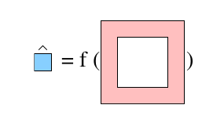

# README

**BlueHat** is a collection of python routines to facilitate the
analysis of spectral (multispectral and hyperspectral) remote sensing
imagery, with an emphasis on various kinds of target detection.  The
package provides collections of utilities that developers can use in
producing algorithms for specific target detection scenarios. In particular,
this package was used to develop the algorithms used by the 
on-board software in the NACHOS project.

# Vision

The _Grande Visione_ is an all-encompassing multi-author open-source
package that does all kinds of spectral image processing, focused
mainly on target and anomaly (and anomalous change) detection. There
is less emphasis on endmembers, segmentation, etc -- though the
package might include basic endmember or segmentation routines if they
are useful for target detection. In this grander vision, machine
learning might play a sizable role (eg, with tools for matched pair
machine learning).

A nearer-term vision is a kind of _'util'_ directory that enables
different target detection projects to use common 'standard'
processing routines.  (I'm thinking: covariance estimation, principal
components and whitening, various matched filters, ROC
[receiver operating characteristic] curve utilities, etc.)  The minimal
aim here is just to avoid all that cutting-and-pasting, and copying
and overwriting, and non-propagating updates that are inevitable when
multiple projects are independently maintained.
 
### About the name

**BlueHat** does not really mean anything at all.  The name refers to
a graphic that describes a particular approach for local background
estimation in multispectral imagery. A pixel under test (indicated in
blue) is estimated as a function of the pixels (indicated in pink) in
an annulus surrounding that pixel.  The "hat" indicates that it is an
estimate.

Although **bluehat** was not chosen to be an acronym, you can perhaps
think of it as **Blue** **H**yperspectral **A**nalysis **T**ools.
And you can perhaps think of "**blue**" as "**B**est **L**et **U**sers
**E**xperiment" -- since the aim of this software is not to furnish
end-users with canned target detectors, but to provide algorithm
developers with utilities that empower them to create their own
designs and to perform their own experiments.  Which is to say: this
software is designed primarily for me, and secondarily for people
like me.

Second place, by the way, was **S**ome **U**tilities for **S**pectral
**I**mage **E**xploitation and **Q**uantification with the acronym
SUSIEQ.  Third place was **L**ocal/**G**lobal **U**tilites for
**S**pectral **I**magery with the acronym LUSI/GUSI.  If you are
looking to write your own spectral image analysis software package,
these names are both available.

# Data structures and file formats

An overall design consideration is the extent to which the package is
more 'matlab-like' in terms of providing basic utilities with generic
interfaces, or more 'pythonic' with data structures that take
advantage of python's object-oriented style.  For instance, should a
data cube "know" which dimension is its spectral dimension? (In other
words, should the "interleave" of a data cube be part of the data
structure?)

In general, I have tried to find a balance that employs generic data
structures (mostly _numpy_ arrays) for the basic objects (such as data
cubes or target spectra) that a user will want to manipulate, while
employing more sophisticated objects "under the hood" for some of the
intermediate processing (such as whitening).  The idea is be as
helpful as possible to the developer without making that developer
totally "buy in" to the **bluehat** system.  (All hats are welcome!)
[On the other hand, I have totally bought into the **bluehat** system
myself, so this compromise may have some ragged edges...]

Having said all that, a **bluehat** image cube _does_ know its
interleave type, but not because it is incorporated into a
higher-level data object, rather because the convention is enforced
that all image cubes are of the BIP form.

Although ENVI format is a kind of a standard in remote sensing (and
GeoTIFF is another "kind of standard"), the **bluehat** file format of
choice is HDF5, which allows multiple datasets, and arbitrary
metadata, all in a single file.  And especially large files can be set
up to be read in efficient incremental ways.
 
# List of Modules

* **basic**: basic spectral routines, means and covariances, and
  infrastructure for dealing with different interleave options (BIP,
  BIL, BSQ).  The standard/default interleave for this package is BIP
  -- "Band Interleaved by Pixel" -- that is: the image cube is encoded
  into a _numpy_ array as [row,sample,band].

* **whiten**: routines for principal components and data whitening

* **rocu**: utilities for ROC curves

* **densitymodels**: implements density models for Gaussian,
  multivariate _t_, and anisotropic fat exponential distributions.

* **ecu**: utilities for elliptically-contoured (EC) distributions,
  primarily the multivariate _t_ distribution.

* **fatexp**: utilities for anisotropic fat exponentials

* **bkgest**: background estimation utilities, including the local
  regression framework, in which a pixel's background is estimated
  from the annulus of pixels that surround it.

* **ioutils**: routines for reading and writing data cubes, target
  spectra, and truth maps from HDF5 data files; some rudimentary
  routines for reading ENVI files.

* **endmember**: (still mostly untested) routines for simple endmember
  and unmixing analysis

* **verbose**: generic utilities for writing informational and/or
  warning messages conditioned on a user-specified level of verbosity.

* ...: In these early stages of development, modules may come and go,
  may be split or combined, or may have their API's extensively
  changed. Sorry about that.

# Relation to Spectral Python (SPy)

Spectral Python (**SPy**) is an excellent package, but **bluehat** is
mostly independent of **SPy** (bluehat currently calls SPy's ENVI
reading libraries, and SPy is totally independent of bluehat).  If you
are thinking about using **bluehat** for the first time, you should
check out **SPy** as well, to see which is more useful for your
purposes.  I have tried to employ more generic data structures in
**bluehat** and I have included utilities that _I_ have found useful
in my own research, and these often differ from what is available in
**SPy**.

# COPYRIGHT

(c) 2023. Triad National Security, LLC. All rights reserved.

This program was produced under U.S. Government contract 89233218CNA000001 for Los Alamos National Laboratory (LANL), which is operated by Triad National Security, LLC for the U.S. Department of Energy/National Nuclear Security Administration. All rights in the program are reserved by Triad National Security, LLC, and the U.S. Department of Energy/National Nuclear Security Administration. The Government is granted for itself and others acting on its behalf a nonexclusive, paid-up, irrevocable worldwide license in this material to reproduce, prepare derivative works, distribute copies to the public, perform publicly and display publicly, and to permit others to do so.

Open-Source Copyright Assertion **C23024** BlueHat

